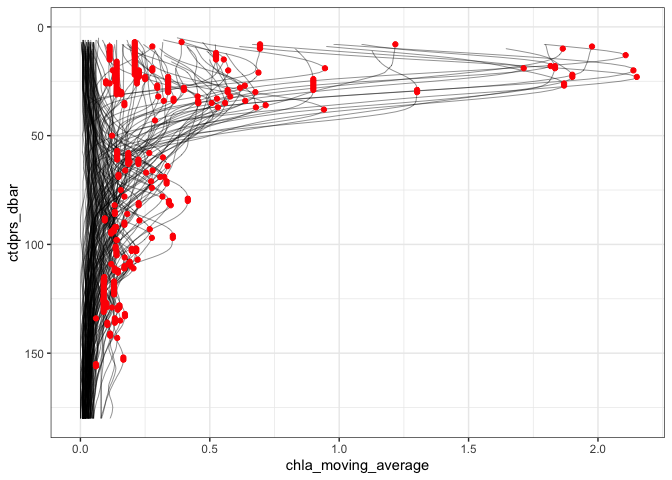
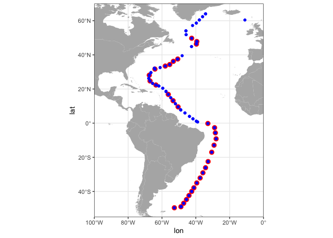

GA02 CTD tidier
================

  - [Preprocessing of the CTD data file using GNU unix
    tools](#preprocessing-of-the-ctd-data-file-using-gnu-unix-tools)
  - [Processing with R](#processing-with-r)
  - [Read metagenomes metadata](#read-metagenomes-metadata)
  - [Determine DCM depth](#determine-dcm-depth)
  - [Mapping](#mapping)

This uses the GEOTRACES Intermediate Data Product 2017 (Version 2)

The license for this data does not allow it to be distributed outside of
the original. See here:

> GEOTRACES Intermediate Data Product (IDP) Download Agreement The
> GEOTRACES programme is keen to ensure that the very significant effort
> and expertise involved in making trace-element and isotope
> measurements is acknowledged as fully as possibly in subsequent
> publications.
> 
> Users of the GEOTRACES Intermediate Data Product are expected to abide
> to the following rules regarding citation
> 
> To the greatest extent possible, please cite all relevant publications
> from researchers that made the measurements you use in your work.
> Details of publications that should be cited are provided
> point-by-point in the IDP dataset (in the ODV and ASCII versions) and
> will be updated on the online database as new papers are published.
> Where your research deals particularly with data measured by a single
> group of data originators, you are invited to please contact that
> group to discuss your work prior to publication and jointly consider
> the synergy and mutual benefit of co-authorship where appropriate.
> 
> Where other constraints prevent citation of all relevant publications,
> for instance where there is a journal limitation on the maximum number
> of publications that can be cited, or if the dataset is only used in a
> minor supportive way, please cite the data compilation itself (as
> below). In such cases, also please cite any original individual papers
> that you rely on particularly heavily for your research and
> interpretations.
> 
> Where using data from the IDP2017 product in your publication, please
> cite the data compilation as: Schlitzer, R., Anderson, R. F.,
> Masferrer Dodas, E, et al., The GEOTRACES Intermediate Data Product
> 2017, Chem. Geol. (2018),
> <https://doi.org/10.1016/j.chemgeo.2018.05.040> .
> 
> Where using data from the IDP2014 product in your publication, please
> cite the data compilation as: Mawji, E., et al., The GEOTRACES
> Intermediate Data Product 2014, Mar. Chem. (2015),
> <http://dx.doi.org/10.1016/j.marchem.2015.04.005> .
> 
> Users of the GEOTRACES Intermediate Data Product shall not distribute
> downloaded data to any third party.

To follow along you muust register with the [the British Oceanographic
Data Centre](https://www.bodc.ac.uk/geotraces/data/idp2017/) and
download the data. We will be using the `CTD Sensor Data` in ODV format.

Note that there [are some
issues](https://www.bodc.ac.uk/data/documents/nodb/544232/) with some of
the IDP data. Fortunately, none of these issues apply to the samples
corresponding to the metagenomes.

Also note that this data is not particularly tidy… What we really want
out of it is the chlorophyll data in order to calculate where the DCM is
in the water column because for some reason no one measured chlorophyll
from the discrete bottles\! Unfortunately, the chlorophyll data exists
in either concentration transformed fluorescence in mg/m3 or in just raw
beam flourescence. This means that the two are not directly comparable,
for example in statistical models, (at least without the formula to
convert between raw beam fluorescence and concentration). However, we
can at least get an idea where the fluorescence peaks at the subsurface
and this way we can calculate where the DCM is and then match that
roughly to where are bottle samples were located.

## Preprocessing of the CTD data file using GNU unix tools

Split into individual cruise transects. Not sure if this is necessary
but I thought that maybe columns are different between cruise sections.
Also some sections join much nicer (GA02, GA03) whereas GP13 and GA10
are particularly problematic

``` bash
grep "^Cruise" ../../GEOTRACES_IDP2017_v1_CTD_Sensor_Data/GEOTRACES_IDP2017_v1_CTD_Sensor_Data.odv_1c69fb81_1.txt > ../../GEOTRACES_IDP2017_v1_CTD_Sensor_Data/GA02_CTD.tsv
grep "^GA02" ../../GEOTRACES_IDP2017_v1_CTD_Sensor_Data/GEOTRACES_IDP2017_v1_CTD_Sensor_Data.odv_1c69fb81_1.txt >> ../../GEOTRACES_IDP2017_v1_CTD_Sensor_Data/GA02_CTD.tsv
```

## Processing with R

``` r
library(here)
library(tidyverse)
library(janitor)
library(fuzzyjoin)
library(magrittr)
library(lubridate)
library(RcppRoll)

`%nin%` <- Negate(`%in%`)
```

``` r
GA02.CTD <- read_tsv(here::here("GEOTRACES_IDP2017_v1_CTD_Sensor_Data", "GA02_CTD.tsv"), col_names = TRUE) %>%
  janitor::clean_names() %>%
  janitor::remove_empty(which = "cols") %>%
  select(-contains("qv_iode"), 
         -contains("infos_"), 
         -contains("standard_dev_"), 
         -qv_odv_sample) %>%
  filter(ctdprs_dbar < 300) %>%
  mutate(longitude_degrees_east=ifelse(longitude_degrees_east > 180, longitude_degrees_east-360, longitude_degrees_east)) %>%
  rename(lat=latitude_degrees_north, lon=longitude_degrees_east) %>%
  select(-type, -yyyy_mm_dd_thh_mm_ss_sss, -bot_depth_m, -processing_info, 
         -info_document, -operators_cruise_name, -cruise_report, -ship_name, 
         -chief_scientist, -geotraces_scientist)
```

``` r
colnames(GA02.CTD)
```

    ##  [1] "cruise"                              
    ##  [2] "station"                             
    ##  [3] "lon"                                 
    ##  [4] "lat"                                 
    ##  [5] "ctdprs_dbar"                         
    ##  [6] "ctdtmp_deg_c"                        
    ##  [7] "ctdsal_pss_78"                       
    ##  [8] "ctdoxy_umol_kg"                      
    ##  [9] "fluorescence_chl_a_mg_m_3"           
    ## [10] "transmissometer_beam_attenuation_1_m"

## Read metagenomes metadata

``` r
GA02.mg <- read_tsv(here::here("tara_simons_timeseries_basic_meta.tsv")) %>% 
  filter(section=="GA02") %>% 
  select(sampleID, bottle_num_BODC, station_num_BODC, lat, lon, depth) %>%
  mutate(station_num_BODC=as.numeric(station_num_BODC)) %>%
  mutate(bottle_num_BODC=as.numeric(bottle_num_BODC)) %>%
  mutate(depthmin=depth-5,
         depthmax=depth+5) %>%
  mutate(depthmin=ifelse(depthmin < 0, 0, depthmin))
```

## Determine DCM depth

First determine the depth of the DCM based on the full CTD profile. Will
save this information and add to final metadata.

``` r
GA02.CTD.chla <- GA02.CTD %>%
  group_by(lat, lon, station) %>%
  mutate(chla_moving_average = roll_mean(fluorescence_chl_a_mg_m_3, 10, align="center", fill=NA)) %>%
  ungroup()

GA02.CTD.dcm <- GA02.CTD.chla %>%
  filter(ctdprs_dbar > 1) %>%
  group_by(lat, lon, station) %>%
  mutate(dcm = ifelse(chla_moving_average == max(chla_moving_average, na.rm=T), TRUE, FALSE)) %>%
  select(cruise, station, lon, lat, ctdprs_dbar, chla_moving_average, dcm)
```

    ## Warning in max(chla_moving_average, na.rm = T): no non-missing arguments to max;
    ## returning -Inf

Plot of chlorophyll profile for each station and the depth of the DCM
from the rolling average approach

``` r
ggplot() +
  geom_path(data=GA02.CTD.chla, aes(y=ctdprs_dbar, x=chla_moving_average), size=0.15) +
  #geom_hline(yintercept = 29, color="red") +
  geom_point(data=GA02.CTD.dcm %>% filter(dcm==TRUE), 
             aes(y=ctdprs_dbar, x=chla_moving_average), color="red") +
  scale_y_reverse(limits=c(180,0)) +
  theme_bw()
```

    ## Warning: Removed 123 row(s) containing missing values (geom_path).

<!-- -->

Can look at stations individually to check (not run)

``` r
ggplot() +
  geom_path(data=GA02.CTD.chla, aes(y=ctdprs_dbar, x=chla_moving_average), size=0.15) +
  #geom_hline(yintercept = 29, color="red") +
  geom_point(data=GA02.CTD.dcm %>% filter(dcm==TRUE), 
             aes(y=ctdprs_dbar, x=chla_moving_average), color="red") +
  facet_wrap(~station) +
  scale_y_reverse(limits=c(180,0)) +
  theme_bw()
```

Seems that this approach worked pretty well to find the DCM

## Mapping

Check how well the bottle samples and the CTD casts line up. Pretty well

``` r
library(sf)
```

    ## Linking to GEOS 3.7.2, GDAL 2.4.2, PROJ 5.2.0

``` r
library("rnaturalearth")
library("rnaturalearthdata")

world <- ne_countries(scale = "medium", returnclass = "sf")

mg.loc <- GA02.mg %>% distinct(lat, lon)
ctd.loc <- GA02.CTD %>% distinct(lat, lon)

ggplot(data = world) + 
  geom_sf(fill = "grey70", color=NA) +
  geom_point(data=mg.loc, aes(x=lon, y=lat), color="red", size=3) +
  geom_point(data=ctd.loc, aes(x=lon, y=lat), color="blue") +
  coord_sf(xlim = c(-100, 0), ylim = c(-55, 70), expand = FALSE) +
  theme_bw()
```

<!-- -->

``` r
GA02.CTD.dcm.depth <- GA02.CTD.dcm %>%
  group_by(lat, lon) %>%
  filter(dcm==TRUE) %>%
  summarize(dcm.depth.m=mean(ctdprs_dbar)) %>% 
  ungroup()
```

Now geojoin based on latitude and longitude to match the dcm depth to
coordinates of the metagenomes

``` r
GA02.dcm.final <- geo_left_join(GA02.mg, GA02.CTD.dcm.depth, 
                        by = c("lat","lon"),
                        distance_col="geojoin.dist.km",
                        max_dist = 50) %>%
  mutate(geojoin.dist.km=geojoin.dist.km*1.60934) %>%
  group_by(sampleID) %>%
  filter(geojoin.dist.km==min(geojoin.dist.km)) %>%
  ungroup() %>%
  group_by(lat.x, lon.x) %>%
  mutate(dcm.depth.diff=abs(dcm.depth.m-depth)) %>%
  mutate(is.dcm = ifelse(abs(dcm.depth.m-depth)==min(abs(dcm.depth.m-depth)), "yes", "no")) %>%
  select(sampleID, lat=lat.x, lon=lon.x, geojoin.dist.km, depth.m=depth, dcm.depth.m, dcm.depth.diff, is.dcm)
```

write the results for later use

``` r
write_tsv(GA02.dcm.final, here::here("CTD2mg", "GA02_dcm.tsv"))
```

``` r
sessionInfo()
```

    ## R version 3.6.1 (2019-07-05)
    ## Platform: x86_64-apple-darwin15.6.0 (64-bit)
    ## Running under: macOS High Sierra 10.13.6
    ## 
    ## Matrix products: default
    ## BLAS:   /Library/Frameworks/R.framework/Versions/3.6/Resources/lib/libRblas.0.dylib
    ## LAPACK: /Library/Frameworks/R.framework/Versions/3.6/Resources/lib/libRlapack.dylib
    ## 
    ## locale:
    ## [1] en_US.UTF-8/en_US.UTF-8/en_US.UTF-8/C/en_US.UTF-8/en_US.UTF-8
    ## 
    ## attached base packages:
    ## [1] stats     graphics  grDevices utils     datasets  methods   base     
    ## 
    ## other attached packages:
    ##  [1] rnaturalearthdata_0.1.0 rnaturalearth_0.1.0     sf_0.8-1               
    ##  [4] RcppRoll_0.3.0          lubridate_1.7.4         magrittr_1.5           
    ##  [7] fuzzyjoin_0.1.5         janitor_1.2.1           forcats_0.4.0          
    ## [10] stringr_1.4.0           dplyr_0.8.3             purrr_0.3.3            
    ## [13] readr_1.3.1             tidyr_1.0.0             tibble_2.1.3           
    ## [16] ggplot2_3.3.0.9000      tidyverse_1.3.0         here_0.1               
    ## 
    ## loaded via a namespace (and not attached):
    ##  [1] Rcpp_1.0.3         lattice_0.20-38    class_7.3-15       assertthat_0.2.1  
    ##  [5] rprojroot_1.3-2    digest_0.6.23      R6_2.4.1           cellranger_1.1.0  
    ##  [9] backports_1.1.5    reprex_0.3.0       evaluate_0.14      e1071_1.7-3       
    ## [13] httr_1.4.1         pillar_1.4.3       rlang_0.4.4        readxl_1.3.1      
    ## [17] geosphere_1.5-10   rstudioapi_0.10    rmarkdown_2.1      labeling_0.3      
    ## [21] munsell_0.5.0      broom_0.5.3        compiler_3.6.1     modelr_0.1.5      
    ## [25] xfun_0.12          pkgconfig_2.0.3    rgeos_0.5-2        htmltools_0.4.0   
    ## [29] tidyselect_0.2.5   fansi_0.4.1        crayon_1.3.4       dbplyr_1.4.2      
    ## [33] withr_2.1.2        grid_3.6.1         nlme_3.1-143       jsonlite_1.6      
    ## [37] gtable_0.3.0       lifecycle_0.1.0    DBI_1.1.0          units_0.6-5       
    ## [41] scales_1.1.0       KernSmooth_2.23-16 cli_2.0.1          stringi_1.4.5     
    ## [45] farver_2.0.3       fs_1.3.1           sp_1.3-2           snakecase_0.11.0  
    ## [49] xml2_1.2.2         generics_0.0.2     vctrs_0.2.2        tools_3.6.1       
    ## [53] glue_1.3.1         hms_0.5.3          yaml_2.2.0         colorspace_1.4-1  
    ## [57] classInt_0.4-2     rvest_0.3.5        knitr_1.27         haven_2.2.0
